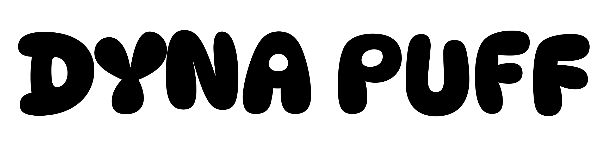
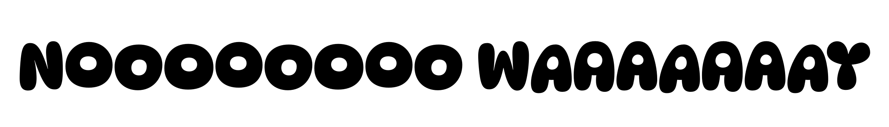

## About

Dynapuff’s loveable demeanor and hand-drawn charm makes it well suited for your, “zomg’s” and “asdfajlskdfjalksdfjkj’s”. 😂😂😂😂😂 Dynapuff features OpenType code that alternates the vertical position of the letters to make those “noooooooooo waaaaaaay”s appear hand-drawn and less like a robot texting on a typewriter. Give it a whirl in Google’s keyboard (Gboard) where you can transform text messages into typographic stickers. Plain text “hahas” are a thing of the past after you’ve sent an “lol” in Dynapuff.

What Dynapuff might lack in subtlety, it makes up for it with its playful and flexible typographic energy. Designed by Toshi Omagari, this casual typeface is optimized for legibility in small text environments like stickers or candy packaging. It also manages to be large when displayed in children’s books to shop signage.

## License

This Font Software is licensed under the SIL Open Font License, Version 1.1.
This license is copied below, and is also available with a FAQ at
https://scripts.sil.org/OFL

## Repository Layout

This font repository structure is inspired by [Unified Font Repository v0.3](https://github.com/unified-font-repository/Unified-Font-Repository), modified for the Google Fonts workflow.
